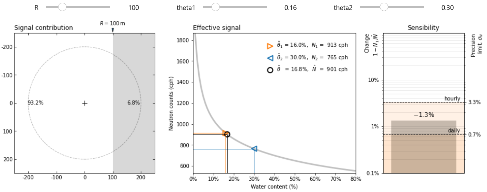
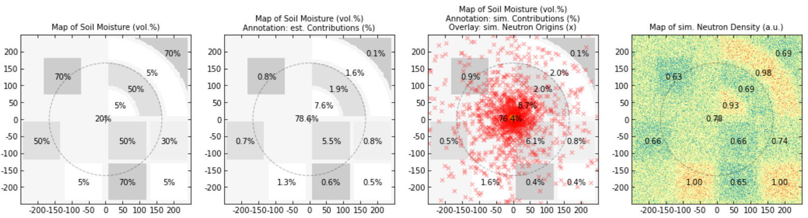

# [CRNS] Signal Contribution and practical footprint estimations

## Interactive calculations

Run the Jupyter Notebook file to play with field areas, footprints, and signal contributions. Try out interactively on Binder!  

Interactively estimate the contribution of remote fields:  

Interactively calculate the practical footprint distance:  

Display user-defined scenarios and URANOS simulations:  

## Install locally

The scripts can be used locally with own data.

1. Download the repository,
2. Install Python 3 and Jupyter (-Lab)
3. Install the required packages with `pip install -r requirements.txt`,
4. Launch the Jupyter notebook
5. Select paths to your own scenario images
6. Run and have fun :-)
